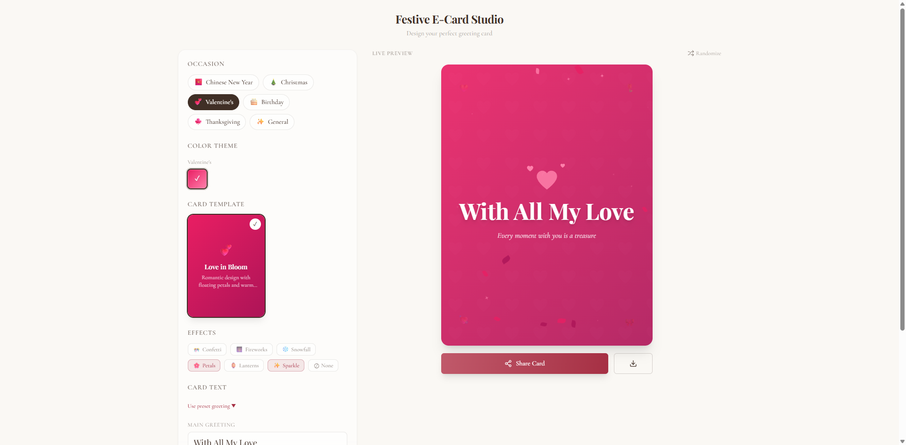

# Festive E-Card Studio

A full-stack animated greeting card platform where users design, customize, and share festive e-cards with AI-powered style transfer and particle effects.

## Screenshots

| Landing Page | Card Editor | Envelope Reveal |
|:---:|:---:|:---:|
|  |  |  |

| Spring Festival | Love Bloom |
|:---:|:---:|
|  |  |

## Highlights

- **6 Holiday Templates** — Chinese New Year, Christmas, Valentine's Day, Birthday, Thanksgiving, and Lunar Festival, each with unique color palettes, patterns, and typography
- **AI Style Transfer** — Transform card artwork into manga, watercolor, oil painting, anime, sketch, or pop-art styles via Replicate (3 free credits per user)
- **7 Particle Effects** — Confetti, fireworks, snowfall, petals, lanterns, sparkle animations built with Framer Motion
- **Real-time Preview** — Live card preview updates as you edit text, template, effects, and AI styles
- **Shareable Links** — Each saved card gets a short URL with OG image metadata for social sharing
- **Postcard Format** — Optional postcard-style layout with address lines and stamp area
- **Envelope Reveal** — Recipients see a sealed envelope with wax seal that opens with a tap, confetti, and typing animation
- **Responsive & Accessible** — Mobile-first design with `prefers-reduced-motion` support, ARIA attributes, and focus trapping

## Tech Stack

| Layer | Technology |
|-------|-----------|
| Framework | Next.js 14 (App Router) |
| Language | TypeScript |
| Styling | Tailwind CSS + CSS custom properties |
| Animation | Framer Motion |
| Database | Supabase (PostgreSQL + Storage) |
| AI | Replicate API (style transfer models) |
| UI | Radix UI primitives, Lucide icons |
| Sharing | QR code generation, OG image rendering |
| Export | html-to-image (card download) |

## Project Structure

```
src/
├── app/
│   ├── page.tsx                  # Landing page with hero + gallery
│   ├── create/page.tsx           # Card editor (UnifiedEditor)
│   ├── card/[shortId]/           # Shareable card viewer
│   │   ├── page.tsx              # Dynamic card page with SSR metadata
│   │   ├── CardViewer.tsx        # Client-side card display + effects
│   │   └── opengraph-image.tsx   # Dynamic OG image generation
│   ├── card/demo/                # Pre-configured demo card
│   └── api/
│       ├── cards/                # CRUD for saved cards
│       ├── generate/             # AI style transfer endpoint
│       └── upload/               # Image upload to Supabase Storage
├── components/
│   ├── editor/
│   │   ├── UnifiedEditor.tsx     # 6-step wizard with live preview
│   │   ├── FormatSelector.tsx    # Card format (standard/postcard)
│   │   ├── StyleSelector.tsx     # AI style picker with credit system
│   │   └── TemplateGallery.tsx   # Template browser with previews
│   ├── templates/
│   │   ├── TemplateRenderer.tsx  # Renders any template by ID
│   │   ├── SpringFestival.tsx    # Chinese New Year template
│   │   ├── WinterWonder.tsx      # Christmas template
│   │   ├── LoveBloom.tsx         # Valentine's template
│   │   ├── PartyPop.tsx          # Birthday template
│   │   ├── GoldenHarvest.tsx     # Thanksgiving template
│   │   ├── LanternGlow.tsx       # Lunar Festival template
│   │   └── PostcardTemplate.tsx  # Postcard format overlay
│   └── share/SharePanel.tsx      # Share link + QR code + download
├── types/card.ts                 # CardConfig, SavedCard, template types
├── hooks/useCredits.ts           # Credit tracking for AI usage
└── data/ai-styles.ts             # AI style definitions and prompts
```

## Getting Started

### Prerequisites

- Node.js 18+
- A [Supabase](https://supabase.com) project (database + storage)
- A [Replicate](https://replicate.com) API token (for AI style transfer)

### Setup

```bash
# Clone and install
git clone <repo-url>
cd e-card
npm install

# Configure environment
cp .env.example .env
# Fill in your Supabase and Replicate credentials

# Start dev server
npm run dev
```

Open [http://localhost:3000](http://localhost:3000) to see the landing page.

### Supabase Setup

Create a `cards` table with the following columns:

| Column | Type | Notes |
|--------|------|-------|
| id | uuid | Primary key, default `gen_random_uuid()` |
| short_id | text | Unique, used for shareable URLs |
| config | jsonb | Full CardConfig object |
| preview_url | text | Stored card preview image URL |
| views | integer | View counter, default 0 |
| created_at | timestamptz | Default `now()` |

Create a `card-previews` storage bucket for uploaded images.

### Environment Variables

| Variable | Required | Description |
|----------|----------|-------------|
| `NEXT_PUBLIC_SUPABASE_URL` | Yes | Supabase project URL |
| `NEXT_PUBLIC_SUPABASE_ANON_KEY` | Yes | Supabase anonymous key |
| `SUPABASE_SERVICE_ROLE_KEY` | Yes | Supabase service role key (server-side) |
| `REPLICATE_API_TOKEN` | Yes | Replicate API token for AI models |
| `NEXT_PUBLIC_SITE_URL` | No | Production URL for OG images |

## Architecture Decisions

- **App Router over Pages Router** — Leverages React Server Components for card metadata, streaming, and `loading.tsx` / `error.tsx` conventions
- **CSS patterns via inline SVG** — Card background patterns (coin circles, snowflakes, hearts) are SVG data URIs in CSS classes, avoiding external image requests
- **Template as component** — Each holiday template is a self-contained React component receiving `CardConfig`, making it easy to add new templates
- **Short ID sharing** — Cards use nanoid-generated short IDs (`/card/abc123`) instead of UUIDs for cleaner sharing URLs
- **OG image generation** — Each card route has a co-located `opengraph-image.tsx` that renders a static preview for social platforms
- **Credit-based AI** — AI style transfer uses Replicate which costs per inference, so a localStorage-based credit system limits free usage to 3 generations while keeping the core template/effects experience unlimited

## Scripts

```bash
npm run dev       # Start development server
npm run build     # Production build
npm run start     # Start production server
npm run lint      # Run ESLint
```

## License

MIT
